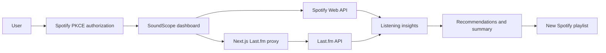

# SoundScope

SoundScope turns Spotify listening history into an interactive profile of a listener’s music taste. It combines Spotify’s personal listening data with Last.fm’s community-generated metadata to surface popularity insights, listening patterns, top artists and tracks, and personalized playlist recommendations.

The project was built as a portfolio piece focused on third-party API integration, resilient frontend state management, and responsive product design.

## Features

- Spotify authorization using the PKCE flow
- Personalized popularity score and music-taste archetype
- Most mainstream and most underground artists
- Top artists and tracks across four-week, six-month, and one-year ranges
- Last.fm tags for additional genre and style context
- Personalized Spotify playlist generation from artists, tracks, or a surprise seed
- Direct link to each successfully created Spotify playlist
- Downloadable PNG summary card
- Responsive phone, tablet, and desktop layouts
- Loading skeletons, empty states, retry controls, and expired-session recovery
- Partial rendering when optional Last.fm metadata is unavailable

## How it works



Spotify provides profile information, top artists, top tracks, popularity values, track search, and playlist creation. Last.fm enriches those results with tags and similar-track recommendations.

The Last.fm API key remains on the server inside a Next.js route handler. Browser requests use `/api/lastfm`, preventing the private key from being exposed in the client bundle.

## Reliability and failure handling

External APIs are not assumed to be perfectly available. SoundScope includes:

- A shared concurrency limit for Last.fm requests
- Upstream request timeouts
- Retries for `429`, `502`, `503`, and `504` responses
- Exponential backoff with jitter
- `Retry-After` support
- Server-side caching for public Last.fm responses
- Independent loading and failure states for artist and track data
- Per-item fallback when Last.fm tags fail
- Spotify session-expiration detection and reconnection
- Partial playlist results when some recommendations cannot be matched

A Last.fm failure does not hide successful Spotify data. Tags are treated as optional enrichment, while Spotify authentication and data failures receive dedicated recovery interfaces.

## Responsive design

The interface uses a viewport-height application shell with an independently scrollable content panel, keeping navigation and the footer available.

- Phones and tablets use horizontally scrollable section navigation.
- Larger screens switch to a vertical sidebar.
- Cards, grids, controls, typography, images, and shadows scale across breakpoints.
- Long track and artist names are constrained without creating page-level overflow.
- Floating information panels are limited by the current viewport.

## Technology

- [Next.js](https://nextjs.org/)
- [React](https://react.dev/)
- [TypeScript](https://www.typescriptlang.org/)
- [Tailwind CSS](https://tailwindcss.com/)
- [shadcn/ui](https://ui.shadcn.com/)
- [Motion](https://motion.dev/)
- [Spotify Web API](https://developer.spotify.com/documentation/web-api)
- [Last.fm API](https://www.last.fm/api)
- [`html-to-image`](https://github.com/bubkoo/html-to-image)
- [Vercel](https://vercel.com/)

## Running locally

### Prerequisites

- Node.js 20 or newer
- A Spotify developer application
- A Last.fm API account and API key

### 1. Clone and install

```bash
git clone git@github.com:eitanamzallag/SoundScope-react.git
cd SoundScope-react
npm install
```

### 2. Configure Spotify

Create an application in the [Spotify Developer Dashboard](https://developer.spotify.com/dashboard). Add the following local redirect URI:

```text
http://127.0.0.1:3000/callback
```

The redirect URI must exactly match the value used by the application.

### 3. Configure environment variables

Create a `.env.local` file in the project root:

```dotenv
NEXT_PUBLIC_SPOTIFY_CLIENT_ID=your_spotify_client_id
NEXT_PUBLIC_SPOTIFY_REDIRECT_URI=http://127.0.0.1:3000/callback
LASTFM_API_KEY=your_lastfm_api_key
```

`NEXT_PUBLIC_SPOTIFY_CLIENT_ID` is intentionally public because Spotify’s PKCE flow does not place a client secret in the browser. `LASTFM_API_KEY` must remain server-side and must not use the `NEXT_PUBLIC_` prefix.

### 4. Start the development server

```bash
npm run dev
```

Open [http://127.0.0.1:3000](http://127.0.0.1:3000).

## Production deployment

The application is designed for deployment on Vercel:

1. Import the GitHub repository into Vercel.
2. Add the three environment variables from the local setup.
3. Set `NEXT_PUBLIC_SPOTIFY_REDIRECT_URI` to the production callback URL.
4. Add that exact production callback URL to the Spotify Developer Dashboard.
5. Deploy the project.

The Last.fm key should be configured for Production and Preview environments when both types of deployments need API access.

## Privacy

SoundScope uses Spotify data to generate the current browser experience. The Spotify access token is stored in session storage and listening data is not permanently stored by this project.

## Project structure

```text
src/
├── app/
│   ├── api/
│   │   ├── lastfm/       # Server proxy and Last.fm client helpers
│   │   └── spotifyAPI.tsx
│   ├── callback/         # Spotify PKCE callback
│   └── top-items/        # Main dashboard
├── components/
│   ├── async-states.tsx  # Loading, empty, auth, and error UI
│   ├── project-info.tsx
│   ├── top-items-divs.tsx
│   └── ui/
└── lib/
    └── auth.ts           # PKCE verifier and challenge utilities
```

## Author

Built by [Eitan Amzallag](https://www.linkedin.com/in/eitan-amzallag/).
